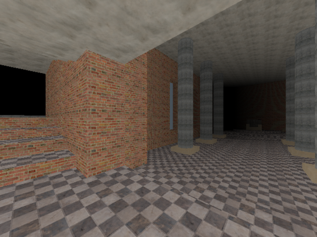

# Software Graphics

This project demonstrates the implementation of old-school 3D software graphics in [Go](https://golang.org/) and [WebAssembly](https://github.com/golang/go/wiki/WebAssembly).

The demo can be accessed at [http://mokiat.com/softgfx/index.html](http://mokiat.com/softgfx/index.html)

## History

Originally, this project was implemented in Pascal and then in Delphi. I wanted to play around with Go and its WebAssembly support and this seemed like the ideal project to port. 

Along the way, I switched to 32 bit colors, from the original 8 bit ones, increased the resolution, fixed some bugs and improved the code. I also introduced my own level generator that converts obj files into bsp extrusion levels (with a lot of caveats).

I have bundled the application and level generator source code into a single repository (a monorepo). Originally they were split into two separate projects - `space-insomnia` and `space-insomnia-levgen` respectively. I have since renamed the project to a more descriptive, yet short, name.

## References

Implementing the software renderer required the usage of both low-level and high-level optimizations, mathematics, data structures and algorithms. A key source of information has been _Ivaylo Belchev_'s masters thesis and the [BOOM 2 Engine](http://www.geocities.ws/SiliconValley/Bay/2234/boom2.htm).

The level that is shown in the demo was modeled in [Blender](https://www.blender.org), exported to an obj file and converted to an extrusion map with the custom level generator. The textures used were downloaded from [TextureHeaven](https://texturehaven.com/) and downscaled to the required size.

Following are some other interesting resources on the subject matter that I have since come across:

* [Lode's Computer Graphics Tutorial - Raycasting](http://lodev.org/cgtutor/raycasting.html)
* [Fabien Sanglard's Duke Nukem 3D: Build Engine Internals](http://fabiensanglard.net/duke3d/build_engine_internals.php)
